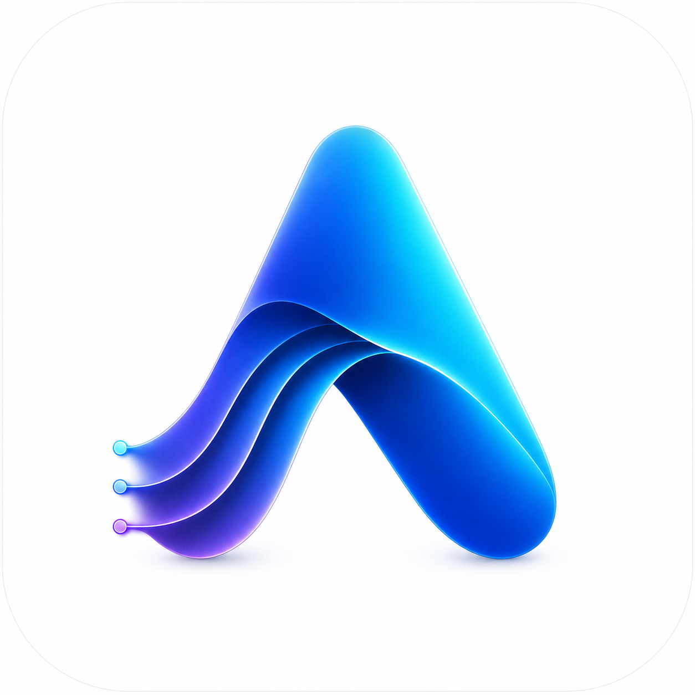

# Aurora

Aurora is a local-first personal RSS reader for macOS, Windows, iPad, and the web. It combines a quiet three-pane reading workflow with a Go service that owns feed fetching, SQLite storage, scheduling, synchronization, AI tasks, and a versioned REST API.



## Highlights

- Folo-inspired flat information architecture with resizable library, timeline, and reader panes
- Responsive iPad PWA and mobile REST interface using the same library as the desktop app
- RSS, Atom, JSON Feed, feed discovery, RSSHub URLs, OPML, full-text extraction, and FTS5 search
- Folders, tags, saved filters, automation rules, read later, starred items, and configurable shortcuts
- OpenAI-compatible and Ollama BYOK profiles with title translation, article summaries, key points, and article chat
- FreshRSS, Google Reader compatible services, Miniflux, Fever, Feedbin, and Nextcloud News adapters
- Concurrent WebDAV and iCloud Drive library synchronization with conflict detection and explicit recovery choices
- Chinese and English interfaces, light and dark themes, and five timeline views

## Install

Download the latest installer from [GitHub Releases](https://github.com/Zijinn/Aurora/releases):

- `Aurora-<version>-macos-universal.dmg` for Apple silicon and Intel Macs
- `Aurora-<version>-windows-x64-setup.exe` for Windows 10/11

Each release contains only the DMG and EXE. GitHub automatically provides the matching source ZIP and TAR archives. Native installers are built by GitHub Actions; local packaging is intentionally not required.

## Sync

Reader service accounts synchronize subscriptions and read/starred state through their native APIs. WebDAV and iCloud Drive synchronize a portable Aurora library snapshot containing feeds, articles, organization, reading state, and preferences.

WebDAV and iCloud targets are independent and may be enabled together. Aurora records a fingerprint for each target: one-sided changes synchronize automatically, while independent changes on both sides stop with a conflict instead of silently overwriting data. The settings page then offers explicit upload-local and restore-from-cloud actions.

iCloud Drive synchronization uses the system's local iCloud folder. On macOS the default file is `iCloud Drive/Aurora/aurora-library.json`; Windows can use the equivalent local iCloud Drive folder when iCloud for Windows is installed.

## AI And Privacy

AI is optional. Provider keys are encrypted with the installation master key and never returned by the REST API. Remote endpoints require explicit approval before article content is transmitted; local Ollama endpoints stay on the device. Title translation sends only the title, while summaries, full translation, key points, and chat use the selected article content.

## Development

Requirements: Go 1.25+, Node.js 22+, and pnpm 11.

```bash
pnpm install
pnpm --dir web install
pnpm dev
```

The web client runs at `http://127.0.0.1:4173` and proxies the API at `http://127.0.0.1:7381`.

Run the full local verification suite:

```bash
make check
bash scripts/check-release-config.sh
```

Build only the web assets or run the desktop adapter without creating an installer:

```bash
pnpm --dir web build
pnpm desktop:dev
```

The REST contract is documented in [api/openapi.yaml](api/openapi.yaml). Architecture and security decisions are in [docs](docs).

## Data And Security

SQLite is authoritative. Existing installations continue to use the operating-system configuration directory named `Cairn` so upgrading to Aurora does not hide or duplicate the current library. The database and owner-only `master.key` must be kept together when restoring a full local backup.

Aurora binds to loopback by default. LAN access must be enabled explicitly and uses one-time device pairing, hashed bearer tokens, scoped origins, and optional TLS. Feed, synchronization, WebDAV, and AI HTTP endpoints share redirect validation, response limits, and SSRF protections; private network access requires an account-level opt-in.

## License

Aurora is licensed under GPL-3.0-only. See [LICENSE](LICENSE) and [THIRD_PARTY_NOTICES.md](THIRD_PARTY_NOTICES.md). The backend design builds on MrRSS; Folo is used as an information-architecture and interaction reference, and Fluent Reader informs synchronization and shortcut behavior.
